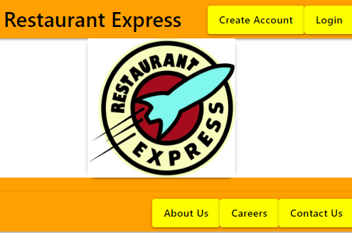
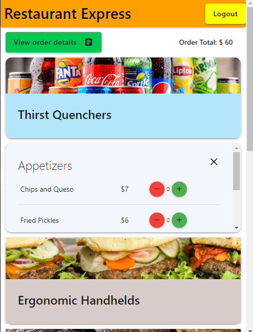
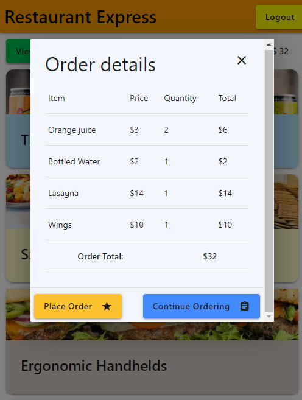

# Restaurant Express

## Description

Restaurant Express is an app for restaurant owners. They only need to upload their menu to the app and everything is done for them. The restaurant will now have the ability to allow customers to create an account and make orders from their menu with the Restaurant Express app. The restaurant will get to use their restaurant name, information, unnique images for their food items, and descriptions with Restaurant Express. Restaurant Express does it all for you.

## Table of Contents
- [Preview](#preview)
- [Installation](#installation)
- [Usage](#usage)
- [Credits](#credits)
- [Collaborators](#collaborators)
- [Questions](#questions)
- [License](#license)

## Preview

Home screenshot

[

Order screenshot

[

Order details screenshot

[

## Installation

clone the repository: git clone git@github.com:esbev/Restaurant

Next from your command line run
    
    npm i

This will install the necessary packages: bcrypt, connect-session-sequelize, dotenv, express, express-handlebars, express-session, mysql2, sequelize

To start the server run

    npm start

## Usage

## Credits

Materialize CSS framework
https://materializecss.com/

Handlebars templating engine
https://handlebarsjs.com/guide/#what-is-handlebars

## Collaborators

    Ian Anderson
    Catherine Nguyen
    Sean Willis
    Eric Beverly

## Questions

GitHub username: esbev

GitHub profile: https://github.com/esbev

Send any questions about the project to: esbev@hotmail.com

## License

MIT License

Copyright (c) 2023 Eric

Permission is hereby granted, free of charge, to any person obtaining a copy
of this software and associated documentation files (the "Software"), to deal
in the Software without restriction, including without limitation the rights
to use, copy, modify, merge, publish, distribute, sublicense, and/or sell
copies of the Software, and to permit persons to whom the Software is
furnished to do so, subject to the following conditions:

The above copyright notice and this permission notice shall be included in all
copies or substantial portions of the Software.

THE SOFTWARE IS PROVIDED "AS IS", WITHOUT WARRANTY OF ANY KIND, EXPRESS OR
IMPLIED, INCLUDING BUT NOT LIMITED TO THE WARRANTIES OF MERCHANTABILITY,
FITNESS FOR A PARTICULAR PURPOSE AND NONINFRINGEMENT. IN NO EVENT SHALL THE
AUTHORS OR COPYRIGHT HOLDERS BE LIABLE FOR ANY CLAIM, DAMAGES OR OTHER
LIABILITY, WHETHER IN AN ACTION OF CONTRACT, TORT OR OTHERWISE, ARISING FROM,
OUT OF OR IN CONNECTION WITH THE SOFTWARE OR THE USE OR OTHER DEALINGS IN THE
SOFTWARE.